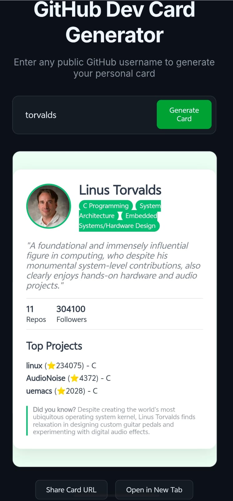

# GitHub Dev Card Generator


## Live Demo

[Click here to view the live app](https://github-card-generator-153768643879.europe-west1.run.app)

---

## Project Overview

**GitHub Dev Card Generator** is a cloud-deployed web application that generates clean developer profile cards using GitHub profile data.

Users can enter any GitHub username, and the application fetches profile information from GitHub and displays it in a visually structured developer card format.

This project demonstrates full-stack development, API integration, backend logic, Docker containerization, and cloud deployment using Google Cloud Run.

---

## Problem Statement

Developers often need a quick and visually appealing way to showcase their GitHub profile. Manually creating portfolio cards can be time-consuming.

This project solves that problem by automatically generating a developer profile card using GitHub data.

---

## Features

- Search GitHub profiles using username
- Fetch developer profile details from GitHub
- Generate a clean developer profile card
- Display profile information in a simple web interface
- Backend and frontend separation
- Dockerized application setup
- Cloud deployment using Google Cloud Run
- Easy to run locally using Docker Compose

---

## Tech Stack

| Area | Technology |
|---|---|
| Backend | Python, FastAPI |
| Frontend | HTML, CSS, JavaScript |
| API | GitHub API |
| Containerization | Docker |
| Deployment | Google Cloud Run |
| Version Control | Git, GitHub |

---

## Project Architecture

```text
User enters GitHub username
        ↓
Frontend sends request to backend
        ↓
Backend fetches data from GitHub API
        ↓
Backend processes profile data
        ↓
Frontend displays developer card
```

---

## Folder Structure

```text
Github_dev_card_generator/
│
├── backend/
│   ├── main.py
│   └── requirements.txt
│
├── frontend/
│   ├── index.html
│   ├── style.css
│   └── script.js
│
├── screenshots/
│   ├── home_page.png
│   ├── generated_card.png
│   └── live_demo.png
│
├── Dockerfile
├── docker-compose.yml
├── .env.example
├── .gitignore
└── README.md
```

---

## Screenshots

### Home Page



### Generated Developer Card


### Live Demo


---

## How to Run Locally

### 1. Clone the Repository

```bash
git clone https://github.com/arfaat007/Github_dev_card_generator.git
```

### 2. Move into the Project Folder

```bash
cd Github_dev_card_generator
```

### 3. Run the Project Using Docker

```bash
docker-compose up --build
```

### 4. Open the App

```text
http://localhost:8000
```

---

## Environment Variables

Create a `.env` file based on `.env.example`.

Example:

```env
GITHUB_TOKEN=your_github_token_here
```

Do not upload your real `.env` file to GitHub.

---

## Deployment

The application is deployed on **Google Cloud Run**.

Live App:

```text
https://github-card-generator-153768643879.europe-west1.run.app
```

---

## Challenges Faced

- Handling invalid or non-existing GitHub usernames
- Fetching and processing GitHub API responses
- Connecting frontend requests with backend API routes
- Managing environment variables securely
- Containerizing the application using Docker
- Deploying the application successfully on Google Cloud Run

---

## Future Improvements

- Add downloadable developer card image
- Add dark/light theme option
- Add repository statistics
- Add contribution graph section
- Add GitHub language usage chart
- Improve mobile responsiveness
- Add authentication for saved cards
- Add shareable card links

---

## Resume Bullet

Built and deployed a full-stack GitHub developer card generator using **Python, FastAPI, Docker, and Google Cloud Run**, enabling users to generate shareable profile cards from GitHub profile data.

---

## Author

**Mohammed Shoaib Arfaat Nayyer**

- GitHub: [@arfaat007](https://github.com/arfaat007)
- Live App: [GitHub Dev Card Generator](https://github-card-generator-153768643879.europe-west1.run.app)
